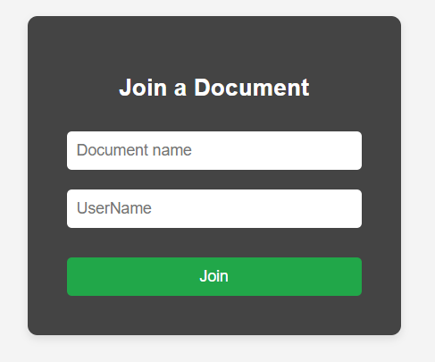

# Real-time Collaborative Document Editor

## Project layout

The project consists of a client app and two small servers:

-   [server/server.ts](./server/server.ts): handles WebSocket communication for the collaborative editor.
-   [server/db-server.ts](./server/db-server.ts): handles api call to persist the document versions history.
-   [editor/](./editor/src/App.tsx): React + TypeScript project consuming both servers.

## Installing dependencies

Run `npm install` on both the `editor/` and `server/` folders.

## Running the project

### Option 1: "Manually"

In order to test the collaborative element from your machine, you will need 3 terminals: one for the servers and the others to launch two instances of the front-end.

#### Starting the servers

Open a terminal into the `server/` folder and run `npm start`. This will start both the WebSockets server (`locahost:4000`) and the database api (`localhost:5000`).

#### Launching two instances of the front-end

1. Open a terminal into the `editor/` folder and run `npm start`.
2. Do the same on a second terminal, and reply 'yes' when prompted if you want to run the app on a different port

### Option 2: Docker Compose

Make sure you have Docker running on your machine. Open a terminal into the root of the project and run

```
docker-compose up --build
```

This will start both the WebSockets server (`locahost:4000`) and the database api (`localhost:5000`), as well as two instances of the front-end, one on `:3000` and the other on `:3001`.
Open two tabs on a browser and navigate to `http://localhost:3000` on one, and `http://localhost:3001` on the other.

## Collaborating

With two instances of the app running, just type in the same document name on both instances to work on the same document.



You can leave the document and join a different one just going back to the initial page and typing in a different document name. If you do the same on the other instance off the app, you'll start collaborating on this new document. You can go back and forth between documents.

## Tests

There are two unit tests for the [RumiEditor.tsx](editor/src/editor/RumiEditor.tsx) component, both in [RumiEditor.test.tsx](editor/src/editor/__tests__/RumiEditor.test.tsx).

To run the tests, open a terminal into the `editor/` directory and run `npm test`.

## Closing comments

I am no designer, and it shows :)
